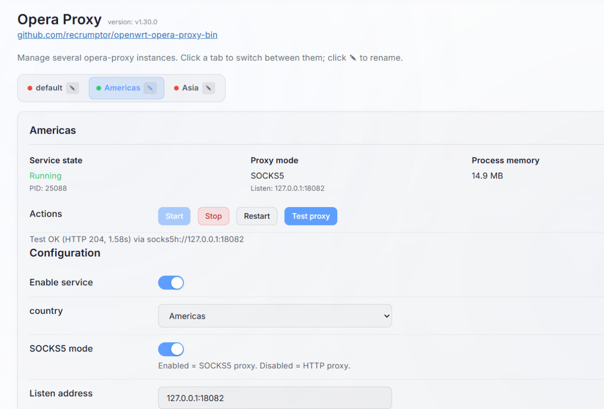

# 🧭 OpenWrt Opera Proxy — Binary Packages
Этот репозиторий содержит готовые `.ipk` и  `.аpk` пакеты клиента **Opera Proxy** для OpenWrt. Пакеты собираются автоматически с использованием официального OpenWrt SDK 24.10. и 25.12.

 📦 Информация о сборке

| Архитектура | Таргет (Target) | Процессоры (Примеры) |
| :--- | :--- | :--- |
| **mipsel_24kc** | `ramips/mt7621` | **MT7621** (Keenetic Viva/Kn-1810, Xiaomi AC2100) |
| **aarch64_cortex-a53** | `mediatek/filogic` | **MT7981/7986** (Xiaomi AX3000T, TUF-AX4200) |
| **x86_64** | `x86/64` | **x86/64** (ПК, мини-ПК, виртуальные машины) |

 Требования к памяти: Размер установленного бинарного файла в /usr/bin/ составляет около 2,5 MB.  (сжат с помощью UPX для уменьшения объема).  Убедитесь, что у вас достаточно свободного места в системном разделе (Flash) или используйте Extroot.

⚙️ Конфигурация.

Файл конфигурации: /etc/config/opera-proxy

Скрипт запуска: /etc/init.d/opera-proxy

Веб-интерфейс: luci-app-opera-proxy

Пример конфигурации:
```
config instance 'default'
  option enabled '1'
  option args '-bind-address 127.0.0.1:18081'

config instance 'Americas'
  option enabled '1'
  option args '-bind-address 127.0.0.1:18082 -country AM -socks-mode'

config instance 'Asia'
  option enabled '1'
  option args '-bind-address 127.0.0.1:18083 -country AS -socks-mode'
```
В данном примере будут запущены три независимых экземпляра: один HTTP-прокси и два SOCKS-прокси.
### 🖥️ LuCI

Для управления Opera Proxy через веб-интерфейс OpenWrt добавлен пакет **`luci-app-opera-proxy`**.

После установки пакет добавляет соответствующий раздел в **LuCI**, где можно управлять отдельными экземплярами Opera Proxy: включать и отключать их, задавать параметры запуска и сетевой адрес/порт.
Выполнять тестирование.

Настройки сохраняются в:

```text
/etc/config/opera-proxy
```

Каждый экземпляр работает как отдельный процесс `procd`, поэтому несколько прокси можно запускать одновременно с разными параметрами и портами.

⚙️ Установка на OpenWrt25.

Скопировать apk-файлы нужной архитектуры в папку tmp

Выполнить в консоли:
```
apk add --allow-untrusted /tmp/opera-proxy-*.apk /tmp/luci-app-opera-proxy-*.apk
```

  Подробнее про настройки можно прочитать на странице https://github.com/Alexey71/opera-proxy

  📚 Источник
Исходный код клиента: [Alexey71/opera-proxy](https://github.com/Alexey71/opera-proxy)


Конфигурация Outbound для Podkop
```
  {
      "type": "http",
      "server": "127.0.0.1",
      "server_port": 18081
    }
```
## Скриншоты (luci-app-opera-proxy, OpenWrt 25.12.5)
<p float="left">  </p>
